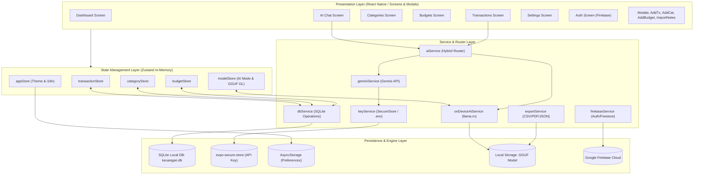
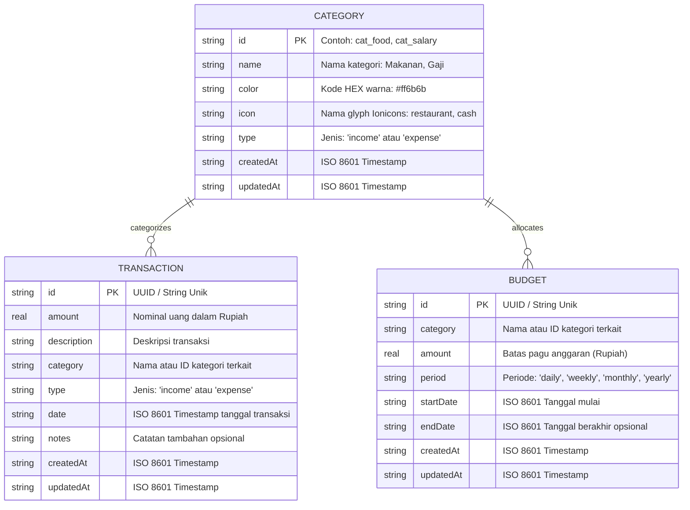
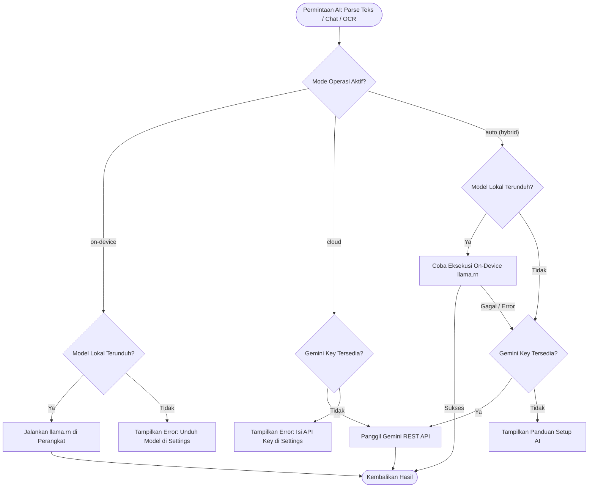

# Informasi Proyek: Keuangan Mobile App (AI Dompet)

Dokumen ini menyajikan panduan arsitektur, spesifikasi teknis, skema data, fitur, dan dokumentasi operasional lengkap untuk **Keuangan Mobile App** (_AI Dompet_).

---

## 1. Ringkasan Proyek & Visi Aplikasi

### 1.1 Ringkasan

**Keuangan Mobile App** (nama paket/identitas: `com.anonymous.fahmiyuda31shinytelegram`, slug: `ai-dompet`) adalah aplikasi pelacak dan manajemen keuangan pribadi (_personal finance tracker_) berbasis mobile yang dirancang dengan filosofi **Offline-First**, **Privat**, **Cepat**, dan bertenaga **Hybrid AI**.

Aplikasi ini dibangun menggunakan ekosistem **React Native** dan **Expo SDK** dengan basis data lokal **SQLite** sebagai sumber kebenaran data (_single source of truth_). Aplikasi ini mengintegrasikan kecerdasan buatan dalam dua layer: inferensi lokal di dalam perangkat (_On-Device AI_ via Gemma 2 2B GGUF dan `llama.rn`) serta inferensi awan (_Cloud AI_ via Google Gemini REST API).

### 1.2 Visi & Nilai Utama

1. **Privasi Penuh (Privacy-First)**: Catatan finansial tersimpan secara lokal di SQLite perangkat pengguna. Pengguna dapat menjalankan fitur AI analisis dan pencatatan transaksi secara 100% offline tanpa perlu mengirim data sensitif ke server eksternal.
2. **Kecepatan & Responsivitas (Offline-First)**: Seluruh interaksi UI tidak bergantung pada latensi jaringan. Aplikasi dapat digunakan kapan pun dan di mana pun.
3. **Pencatatan Cerdas Multi-Kanal (Smart Multi-Channel Input)**: Mempermudah pencatatan melalui teks bahasa alami (_Natural Language Parsing_), OCR struk belanja (_Receipt Scanner_), dan import cerdas berkas catatan (termasuk berkas Samsung Notes `.sdocx` dan tabel Markdown/VPS).
4. **Analisis Finansial Komprehensif**: Dashboard analitik real-time dengan grafik visual, perbandingan rasio pengeluaran terhadap pendapatan, serta asisten keuangan virtual (_Financial AI Advisor_) dengan token streaming real-time.

---

## 2. Arsitektur & Prinsip Desain Teknis

Aplikasi ini mengadopsi arsitektur berlapis (_layered architecture_) yang modular, memudahkan isolasi logika bisnis, pengelolaan status aplikasi, dan pemeliharaan jangka panjang.



### 2.1 Pola Penyimpanan Data (Zustand In-Memory + SQLite Write-Through)

- **Single Source of Truth**: Seluruh data transaksi, kategori, dan anggaran disimpan secara persisten di berkas SQLite lokal `keuangan.db` melalui `expo-sqlite`.
- **In-Memory Cache**: Zustand store mempertahankan cache data di memori aplikasi untuk performa rendering UI 60/120 FPS tanpa lag.
- **Write-Through**: Setiap operasi penambahan, pengubahan, atau penghapusan data selalu mengeksekusi operasi database SQLite secara sinkron/asinkron melalui `dbService.ts` sebelum memperbarui state Zustand.
- **Inisialisasi Cepat**: Saat aplikasi dimuat (`app/index.tsx`), seed kategori dijalankan jika database masih kosong, lalu `loadFromDb()` memuat data ke dalam store.

### 2.2 Arsitektur Hybrid AI Router

Layanan AI dirancang secara fleksibel melalui `src/services/aiService.ts` dengan 3 mode operasi:

1. **On-Device (Offline)**: Menggunakan engine inferensi lokal `llama.rn` untuk menjalankan model LLM quantized (Gemma 2 2B IT GGUF). Bebas kuota internet dan privat.
2. **Cloud (Online)**: Menggunakan REST API Google Gemini (`gemini-2.5-flash` / `gemini-1.5-flash`) via `fetch` native tanpa dependensi SDK besar.
3. **Auto (Hybrid Fallback)**: Memprioritaskan On-Device AI jika model sudah diunduh ke perangkat; jika gagal atau model belum tersedia, sistem secara otomatis melakukan fallback transparan ke Cloud Gemini API.

### 2.3 Keamanan & Manajemen Kredensial

- **Secure Storage**: API Key Gemini diprioritaskan tersimpan di enkripsi hardware perangkat melalui `expo-secure-store`, dengan fallback ke environment variable `EXPO_PUBLIC_GEMINI_API_KEY`.
- **SQL Injection Prevention**: Seluruh query SQL di `dbService.ts` menggunakan parameterized queries (`?` placeholder).
- **Reserved Keyword Handling**: Nama entitas transaksi menggunakan tanda petik ganda (`"Transaction"`) dalam query SQL guna mencegah bentrokan dengan reserved keyword SQLite.

---

## 3. Tech Stack & Spesifikasi Dependensi

### 3.1 Spesifikasi Inti

| Komponen                  | Versi / Spesifikasi                    | Keterangan                                    |
| :------------------------ | :------------------------------------- | :-------------------------------------------- |
| **Runtime & Bundler**     | Expo SDK 57 (`~57.0.22`) / Expo Router | Entrypoint native menggunakan `app/index.tsx` |
| **Core Framework**        | React Native `0.86.3` / React `19.2.3` | Arsitektur modern dengan React Compiler       |
| **Bahasa Pemrograman**    | TypeScript `~6.0.3`                    | Strict type checking tanpa `any` liar         |
| **State Management**      | Zustand `^5.0.14`                      | In-memory reactive state manager              |
| **Basis Data Lokal**      | `expo-sqlite` `~57.0.3`                | Driver native SQLite C-engine                 |
| **Inference Engine (AI)** | `llama.rn` `^0.13.0-rc.1`              | Binding React Native untuk `llama.cpp`        |
| **Cloud AI Provider**     | Google Gemini REST API                 | Endpoint `v1beta/models/...:generateContent`  |
| **Cloud Storage/Auth**    | Firebase JS SDK `^12.17.1`             | Firestore NoSQL + Firebase Auth Email/Pass    |

### 3.2 Pustaka UI, Media, & Utility Pendukung

- **Navigasi**: `@react-navigation/native`, `@react-navigation/bottom-tabs`, `@react-navigation/native-stack`
- **Visualisasi & Grafik**: `react-native-chart-kit`, `react-native-svg`
- **Media & Kamera**: `expo-camera`, `expo-image-picker`, `expo-image`
- **Penyimpanan File & Berbagi**: `expo-file-system`, `expo-sharing`, `expo-print`, `expo-document-picker`
- **Dekompresi & Parser**: `pako` (dekompresi gzip/deflate untuk berkas Samsung Notes `.sdocx`), `uuid`
- **Keamanan & Perangkat**: `expo-secure-store`, `expo-constants`, `@react-native-community/netinfo`
- **Animasi & Interaksi**: `react-native-reanimated`, `react-native-gesture-handler`, `expo-linear-gradient`

---

## 4. Struktur Direktori Proyek

```
keuangan-mobile-app/
├── app/                          # Expo Router entry point
│   └── index.tsx                 # Root application wrapper, DB init, & Auth gate
├── assets/                       # Aset ikon, gambar splash, dan font
│   └── images/
├── docs/                         # Dokumentasi teknis proyek
│   ├── GEMINI-INTEGRATION-GUIDE.md
│   ├── IMPLEMENTATION-CHECKLIST.md
│   ├── PRD-Keuangan-Mobile-App.md
│   ├── PROJECT-INFO.md           # [Dokumen Ini] Panduan komprehensif proyek
│   └── SETUP-SUMMARY.md
├── src/                          # Sumber kode utama aplikasi
│   ├── components/               # Komponen UI modular
│   │   ├── common/               # Komponen teks dan view bertema
│   │   ├── ui/                   # Button, Card, Input, Modal, ModelSelect, Collapsible
│   │   ├── AddBudgetModal.tsx    # Modal tambah/edit anggaran
│   │   ├── AddCategoryModal.tsx  # Modal tambah/edit kategori
│   │   ├── AddTransactionModal.tsx # Modal transaksi (manual, AI assist, & OCR struk)
│   │   └── ImportTransactionsModal.tsx # Modal import data teks/sdocx/VPS
│   ├── constants/                # Konstanta tema, warna, dan token tipografi
│   │   ├── index.ts
│   │   └── theme.ts              # Palet warna Light & Dark mode
│   ├── database/                 # Definisi tipe data & model
│   │   └── models/               # Transaction, Category, Budget interfaces
│   ├── hooks/                    # Custom React hooks (useTheme, useColorScheme)
│   ├── i18n/                     # Internasionalisasi (ID: Bahasa Indonesia, EN: English)
│   ├── navigation/               # Navigasi React Navigation (Tab & Stack)
│   │   ├── BottomTabNavigator.tsx# Konfigurasi 6 tab utama
│   │   ├── index.tsx             # Root Stack Navigator
│   │   └── types.ts              # Type definition rute navigasi
│   ├── screens/                  # Layar aplikasi utama
│   │   ├── ai/
│   │   │   └── AIChatScreen.tsx  # Asisten keuangan AI dengan token streaming
│   │   ├── budgets/
│   │   │   └── BudgetsScreen.tsx # Manajemen anggaran per kategori
│   │   ├── categories/
│   │   │   └── CategoriesScreen.tsx # Manajemen kategori pengeluaran/pemasukan
│   │   ├── dashboard/
│   │   │   └── DashboardScreen.tsx  # KPI finansial, Pie chart, & Bar chart tren
│   │   ├── transactions/
│   │   │   └── TransactionsScreen.tsx # List transaksi, filter, seleksi, & ekspor
│   │   ├── AuthScreen.tsx        # Layar autentikasi login/registrasi Firebase
│   │   └── SettingsScreen.tsx    # Pengaturan AI, tema, bahasa, backup, & manajemen model
│   ├── services/                 # Layar logika bisnis & I/O
│   │   ├── aiService.ts          # Hybrid AI Router (On-Device & Cloud fallback)
│   │   ├── dbService.ts          # CRUD SQLite lokal, migrasi DB, & summary generator
│   │   ├── envService.ts         # Wrapper variabel lingkungan
│   │   ├── exportService.ts      # Ekspor file CSV, PDF, dan JSON backup lokal
│   │   ├── firebaseService.ts    # Sinkronisasi cloud Firestore & Firebase Auth
│   │   ├── geminiService.ts      # Integrasi Google Gemini REST API (Chat, text parse, OCR)
│   │   ├── keyService.ts         # SecureStore API Key resolver
│   │   └── onDeviceAiService.ts  # llama.rn context manager & downloader model GGUF
│   ├── store/                    # Zustand Store in-memory
│   │   ├── appStore.ts           # Tema (Light/Dark/System) & Bahasa (id/en)
│   │   ├── budgetStore.ts        # State anggaran
│   │   ├── categoryStore.ts      # State kategori
│   │   ├── modelStore.ts         # State unduhan model AI & mode operasi
│   │   └── transactionStore.ts   # State transaksi & helper deduplikasi
│   └── utils/                    # Utilitas pembantu
│       ├── aggregate.ts          # Agregasi data statistik & format CSV
│       ├── firebaseSync.ts       # Konverter data lokal ke payload dokumen Firestore
│       ├── import.ts             # Parser regex cerdas teks catatan keuangan
│       └── sdocx.ts              # Unzipper & parser file biner Samsung Notes (.sdocx)
├── .env.example                  # Template variabel lingkungan
├── app.json                      # Konfigurasi Expo Application & Build Plugins
├── eslint.config.js              # Flat config ESLint
├── package.json                  # Dependensi NPM & scripts
└── tsconfig.json                 # Konfigurasi compiler TypeScript
```

---

## 5. Skema Database & Relasi Entitas

Basis data lokal menggunakan SQLite dengan nama berkas `keuangan.db`. Relasi antar entitas dimodelkan secara logis melalui atribut `category`.

### 5.1 Diagram Relasi Entitas (ERD)



### 5.2 Catatan Teknis Skema

1. **Reserved Keyword SQLite**: Tabel `Transaction` merupakan kata kunci terpesan pada SQL engine, sehingga seluruh query SQL dieksekusi dengan tanda petik ganda (`"Transaction"`).
2. **Kategori Bawaan (Seeding)**: Pada saat instalasi pertama, tabel `Category` diinisialisasi secara otomatis dengan kategori standar:
   - _Pemasukan_: Gaji (`cat_salary`), Bonus (`cat_bonus`), Investasi (`cat_investment`), Lainnya (`cat_other_income`).
   - _Pengeluaran_: Makanan (`cat_food`), Transportasi (`cat_transport`), Hiburan (`cat_entertainment`), Utilitas (`cat_utilities`), Kesehatan (`cat_health`), Pendidikan (`cat_education`), Belanja (`cat_shopping`), Lainnya (`cat_other_expense`).

---

## 6. Fitur Utama & Alur Penggunaan

### 6.1 Dashboard & Visualisasi Analitik

- **KPI Finansial Cepat**: Kartu ringkasan total pemasukan, total pengeluaran, saldo bersih (_net balance_), serta rasio persentase pengeluaran terhadap pemasukan.
- **Filter Periode Fleksibel**: Pilihan rentang waktu Harian (_Daily_), Mingguan (_Weekly_), Bulanan (_Monthly_), dan Tahunan (_Yearly_) lengkap dengan kontrol pemilih tanggal (_DatePicker_).
- **Grafik Tren Batang (Bar Chart)**: Menampilkan tren pemasukan vs pengeluaran antar waktu dengan pembagian bucket dinamis.
- **Grafik Distribusi Kategori (Pie Chart)**: Menampilkan 6 porsi pengeluaran kategori terbesar dalam periode yang dipilih.
- **Daftar Transaksi Terbaru**: Menampilkan 5 transaksi paling mutakhir untuk akses cepat.

### 6.2 Manajemen Transaksi (CRUD & Filter Lanjutan)

- **Operasi CRUD Penuh**: Tambah, ubah, dan hapus transaksi dengan validasi skema.
- **Penyaringan Lanjutan (Advanced Filtering)**:
  - Preset tombol cepat: _Hari Ini_, _Minggu Ini_, _Bulan Ini_.
  - Pemilihan rentang tanggal kustom (_Custom Date Range_) dengan kalender interaktif.
- **Pencegahan Data Duplikat**: Otomatis mendeteksi potensi entri ganda berdasarkan kesamaan nominal, tanggal, tipe, dan deskripsi, dengan dialog konfirmasi kepada pengguna.
- **Seleksi Massal (Batch Delete)**: Mode multi-select untuk menandai dan menghapus banyak transaksi sekaligus.
- **Ekspor untuk AI Prompting**: Tombol khusus untuk menyalin daftar transaksi terfilter langsung ke clipboard dalam format Tabel Markdown, Teks Terstruktur, atau JSON untuk kemudahan analisis di LLM eksternal.

### 6.3 Input Cerdas (Smart Input) & Parser Berkas

- **AI Natural Language Parsing**: Mengubah teks sehari-hari menjadi transaksi terstruktur.
  - _Contoh_: `"makan siang padang 35rb"` $\rightarrow$ Amount: 35.000, Category: Makanan, Type: expense.
- **OCR Scan Struk Belanja**: Ambil foto langsung melalui kamera HP atau pilih foto struk dari galeri. AI membaca merchant, tanggal, total nominal, dan kategori secara otomatis.
- **Import Catatan Samsung Notes (`.sdocx`)**:
  - Pengguna dapat memilih file `.sdocx` langsung dari penyimpanan HP.
  - Modul `sdocx.ts` memanfaatkan algoritma `pako` untuk membuka kontainer ZIP biner Samsung Notes dan mengekstrak teks catatan tanpa perantara aplikasi pihak ketiga.
- **Import Teks Bebas & Tabel VPS**: Mendukung tempel teks multi-baris dari catatan harian, format pipe-delimited (`| Tanggal | Deskripsi | Jumlah |`), dan pengenalan format tanggal otomatis.

### 6.4 Kategori & Budgeting

- **Kategori Fleksibel**: Tambah kategori baru dengan pemilih palet warna dan ikon Ionicons yang kaya.
- **Alokasi Anggaran (Budget Guard)**: Tentukan batas anggaran pengeluaran berdasarkan kategori tertentu per siklus (harian, mingguan, bulanan, tahunan) untuk mengontrol gaya hidup konsumtif.

### 6.5 AI Financial Advisor (Interactive Chat)

- **Konsultasi Keuangan Interaktif**: Antarmuka chat modern untuk mendiskusikan kondisi finansial pribadi.
- **Injeksi Konteks Otomatis**: Setiap prompt pengguna secara otomatis diperkaya dengan konteks finansial terbaru yang dirangkum langsung dari database SQLite (total saldo, 15 transaksi terakhir, breakdown kategori, dan status budget).
- **Token Streaming Real-Time**: Saat menggunakan model On-Device, teks jawaban muncul secara bertahap (per-kata) memberikan latensi visual yang sangat responsif.
- **Pertanyaan Cepat (Quick Suggestions)**: Tombol instan seperti _"Bagaimana kondisi keuangan saya bulan ini?"_, _"Apa pengeluaran terbesar saya?"_, dan _"Beri saya saran untuk berhemat"_.

### 6.6 Backup, Restore, & Ekspor Data

- **Ekspor Dokumen**: Mengonversi catatan transaksi menjadi dokumen CSV atau PDF yang siap dibagikan via `expo-sharing`.
- **Backup Lokal (JSON)**: Ekspor keseluruhan data (transaksi, kategori, anggaran) ke dalam satu berkas `.json` lokal yang dapat dipulihkan kapan saja.
- **Cloud Backup (Firebase Firestore)**:
  - Autentikasi aman berbasis Email dan Password.
  - Batching pintar (maksimum 450 item per batch commit) untuk menghindari limitasi kuota Firestore.
  - Mode penggabungan data (_merge restore_) yang menjaga integritas data lokal.

### 6.7 Personalisasi

- **Mode Tampilan**: Terang (_Light_), Gelap (_Dark_), dan Otomatis sesuai pengaturan sistem (_System_).
- **Multi-Bahasa**: Dukungan penuh Bahasa Indonesia (`id`) dan Bahasa Inggris (`en`).

---

## 7. Sistem AI Hybrid (On-Device & Cloud)

### 7.1 Perbandingan Kapabilitas Engine AI

| Aspek                   | On-Device AI (Offline)                                   | Cloud AI (Google Gemini)                     |
| :---------------------- | :------------------------------------------------------- | :------------------------------------------- |
| **Model**               | Gemma 2 2B Instruct (Q4_K_M GGUF)                        | Gemini 2.5 Flash / Gemini 1.5 Flash          |
| **Konektivitas**        | 100% Offline (Tanpa Internet)                            | Membutuhkan Koneksi Internet Aktif           |
| **Privasi Data**        | Data finansial tidak pernah keluar dari memori HP        | Teks/Gambar dikirim ke endpoint Google Cloud |
| **Biaya Kuota**         | Gratis (hanya unduhan awal model ~1.6 GB)                | Konsumsi data internet per request           |
| **Akselerasi Hardware** | GPU (OpenCL), NPU/DSP (Hexagon), CPU Multi-thread        | Dikelola di server Google                    |
| **Kebutuhan Storage**   | ~1.6 GB ruang penyimpanan lokal                          | 0 MB storage lokal                           |
| **Fitur OCR Struk**     | Eksperimental (bergantung ketersediaan vision projector) | Sangat Akurat (Gemini Multimodal Vision)     |
| **Chat Streaming**      | Didukung (native token streaming via `llama.rn`)         | Full payload response via REST               |

### 7.2 Alur Logika Router AI (`aiService.ts`)



### 7.3 Manajemen Unduhan Model Lokal

- **Deteksi Jaringan Seluler**: Saat pengguna menekan unduh model, aplikasi mendeteksi jenis koneksi via `@react-native-community/netinfo`. Jika menggunakan kuota data seluler, aplikasi menampilkan dialog konfirmasi guna mencegah pembengkakan kuota internet pengguna.
- **Progress Tracking**: Menampilkan persentase unduhan dan ukuran byte secara real-time.
- **Manajemen Memori Bersih**: Terdapat fungsi `releaseAISession()` yang secara eksplisit membebaskan alokasi RAM/VRAM C++ saat pengguna keluar dari layar chat.

---

## 8. Panduan Setup & Menjalankan Aplikasi

### 8.1 Prasyarat Sistem

1. **Node.js**: Versi `22.x` (sesuai spesifikasi engine pada `package.json`).
2. **Package Manager**: `npm`.
3. **Android Studio**: Android SDK Platform 34+, Android SDK Build-Tools, Android NDK, dan emulator atau perangkat fisik Android dengan kabel USB debugging.
4. **Xcode** (Khusus macOS untuk target iOS): CocoaPods dan iOS Simulator.

> [!IMPORTANT]
> Karena aplikasi ini menggunakan modul native C++ (`llama.rn` dan `expo-sqlite`), aplikasi **TIDAK BISA** dijalankan melalui aplikasi **Expo Go**. Pengguna wajib menjalankan **Development Build** (`npx expo run:android` atau `npx expo run:ios`).

### 8.2 Langkah Instalasi & Build

1. **Clone Repositori & Masuk Direktori**:

   ```bash
   git clone <url-repo>
   cd keuangan-mobile-app
   ```

2. **Instal Dependensi NPM**:

   ```bash
   npm install
   ```

3. **Konfigurasi File Environment**:
   Salin berkas template environment:

   ```bash
   cp .env.example .env
   ```

   _(Silakan isi `EXPO_PUBLIC_GEMINI_API_KEY` atau variabel Firebase jika ingin menggunakan fitur cloud)_.

4. **Eksekusi Prebuild Native (Wajib)**:
   Perintah ini akan men-generate folder native `android/` dan `ios/` yang telah dikonfigurasi dengan plugin build:

   ```bash
   npm run prebuild
   ```

5. **Jalankan Aplikasi pada Perangkat Android (Dev Build)**:
   Pastikan perangkat fisik atau emulator Android sudah terdeteksi (`adb devices`):

   ```bash
   npm run android
   ```

6. **Menjalankan Dev Server Metro**:
   Jika build native sudah terpasang di perangkat, Anda cukup menjalankan Metro bundler:
   ```bash
   npm start
   ```

### 8.3 Perintah Verifikasi Kualitas Kode

Sebelum melakukan commit perubahan kode, selalu jalankan urutan pengujian kualitas berikut:

```bash
# 1. Analisis linter
npm run lint

# 2. Pemeriksaan tipe statis TypeScript
npm run type-check

# 3. Pemeriksaan format kode
npm run format:check
```

Jika terdapat kesalahan format atau lint otomatis:

```bash
npm run lint:fix
npm run format
```

---

## 9. Konfigurasi Environment Variable

Konfigurasi disimpan dalam file `.env` di root proyek. Karena menggunakan Expo, variabel yang diakses di sisi client **wajib** menggunakan prefix `EXPO_PUBLIC_`.

| Variabel Lingkungan                        | Nilai Bawaan / Contoh         | Deskripsi                                                                           | Sifat                   |
| :----------------------------------------- | :---------------------------- | :---------------------------------------------------------------------------------- | :---------------------- |
| `EXPO_PUBLIC_GEMINI_API_KEY`               | `AIzaSy...`                   | API Key Google Gemini untuk fitur AI Cloud. Dapat dioverride lewat menu Pengaturan. | Opsional (Fallback)     |
| `EXPO_PUBLIC_HF_MODEL_URL`                 | URL model di HuggingFace      | Alamat unduh langsung bobot model GGUF.                                             | Opsional                |
| `EXPO_PUBLIC_HF_MODEL_FILENAME`            | `gemma-2-2b-it-Q4_K_M.gguf`   | Nama file lokal saat model disimpan di storage HP.                                  | Opsional                |
| `EXPO_PUBLIC_FIREBASE_API_KEY`             | `AIzaSy...`                   | Firebase Web API Key untuk sinkronisasi cloud.                                      | Opsional (Cloud Backup) |
| `EXPO_PUBLIC_FIREBASE_AUTH_DOMAIN`         | `project.firebaseapp.com`     | Domain autentikasi Firebase.                                                        | Opsional (Cloud Backup) |
| `EXPO_PUBLIC_FIREBASE_PROJECT_ID`          | `divine-beanbag-355600`       | ID proyek Google Firebase.                                                          | Opsional (Cloud Backup) |
| `EXPO_PUBLIC_FIREBASE_STORAGE_BUCKET`      | `project.firebasestorage.app` | Bucket Firebase Storage.                                                            | Opsional (Cloud Backup) |
| `EXPO_PUBLIC_FIREBASE_MESSAGING_SENDER_ID` | `629482976175`                | Sender ID Firebase Cloud Messaging.                                                 | Opsional (Cloud Backup) |
| `EXPO_PUBLIC_FIREBASE_APP_ID`              | `1:629482976175:web:...`      | ID aplikasi Web Firebase.                                                           | Opsional (Cloud Backup) |
| `EXPO_ROUTER_DISABLE_RN_NAVIGATION_CHECK`  | `1`                           | Mematikan peringatan kompatibilitas navigasi.                                       | Rekomendasi             |

---

## 10. Ringkasan Status Rilis & Rencana Lanjutan

- **Status Versi Saat Ini**: `v1.0.0`
- **Fitur Selesai**:
  - [x] Basis Data Lokal SQLite & State Management Zustand write-through
  - [x] Dashboard Interaktif (KPI, Grafik Batang, Grafik Lingkaran, Filter Tanggal)
  - [x] Manajemen Transaksi Lengkap (CRUD, Filter Kalender, Batch Delete, Deteksi Duplikat)
  - [x] Smart Input (Natural Language Parser & OCR Scan Struk Belanja)
  - [x] Ekspor Laporan (CSV, PDF, JSON Backup Lokal, Salin Prompt AI)
  - [x] Import Catatan Cerdas (Dukungan penuh format teks, tabel VPS, dan Samsung Notes `.sdocx`)
  - [x] Manajemen Kategori & Pagu Anggaran (Budgeting)
  - [x] Arsitektur Hybrid AI (On-Device Gemma 2B via `llama.rn` + Cloud Gemini API)
  - [x] Asisten Finansial Interaktif dengan Token Streaming Real-Time
  - [x] Multi-bahasa (Indonesia & English) dan Mode Tema (Terang/Gelap/Sistem)
  - [x] Cloud Backup & Restore via Firebase Firestore
- **Rencana Peningkatan Mendatang**:
  - [ ] Integrasi On-Device Vision Projector untuk OCR Struk belanja 100% offline tanpa Gemini Cloud.
  - [ ] Fitur transaksi berulang otomatis (_recurring transactions / scheduled reminders_).
  - [ ] Widget layar beranda (_Android App Widget_) untuk input cepat satu sentuhan.
